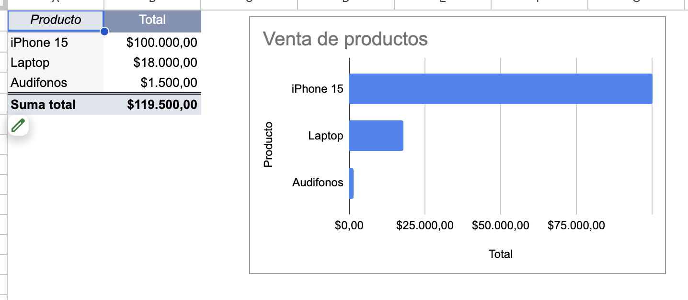

# Dashboard de Inteligencia Comercial en Google Sheets

## 📌 Problema de Negocio
El procesamiento de datos comerciales se realizaba de forma manual, generando errores de captura y una demora considerable en la entrega de reportes críticos. La falta de una herramienta centralizada dificultaba la identificación rápida de los productos con mayor tracción y rentabilidad.

## 🚀 Solución de Sistemas
Se diseñó un sistema de información en **Google Sheets** que transforma registros transaccionales en un Dashboard interactivo para la toma de decisiones estratégicas.

### 1. Fase de Extracción y Transformación (ETL)
Se procesaron los datos crudos, estandarizando formatos de fecha y moneda, y consolidando los registros transaccionales para asegurar la integridad de la información.

### 2. Fase de Visualización y Análisis (BI)
Se implementó una Tabla Dinámica y un Gráfico de Barras vinculados, permitiendo al usuario final visualizar el **Total de Ventas por Producto** de forma inmediata y dinámica.

## 📊 Resultados e Impacto
* **Agilidad en la Decisión:** El tiempo para identificar el producto más vendido se redujo drásticamente.
* **Identificación de Tendencias:** El Dashboard permite visualizar claramente que el 'iPhone 15' representa la mayor fuente de ingresos, facilitando el ajuste de estrategias de inventario.
* **Eliminación de Error Humano:** El cálculo del 'Total' y los resúmenes están automatizados, asegurando la precisión de la información financiera.

---
**Desarrollado por:** Manuel Sosa Sanchez
**Perfil:** Licenciado en Sistemas Computacionales | Especialista en Análisis de Datos
